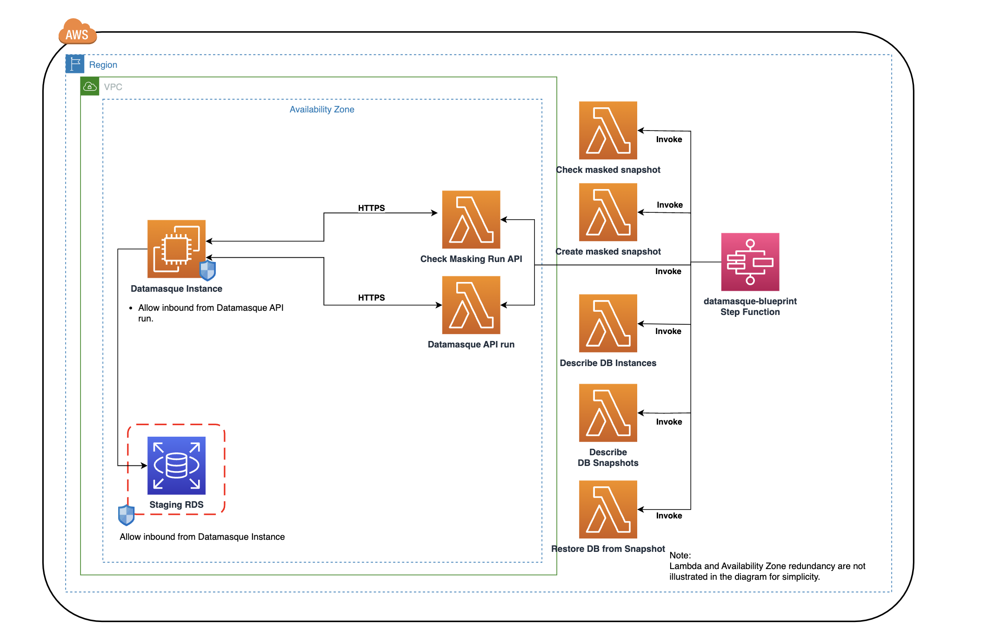

# DataMasque AWS RDS Masking Stepfunctions Blueprint

## Introduction

The DataMasque AWS RDS Masking Blueprint provides a reusable masked data provisioning pipeline using AWS Step Functions and DataMasque APIs. These AWS CloudFormation-based templates are designed to automate the masking of production RDS Databases, creating masked snapshots that are safe for use in non-production environments. This workflow can also be triggered directly from the DataMasque UI.

The diagram below illustrates the reference architecture for DataMasque in AWS. The provided CloudFormation template automates the process of masking production RDS snapshots and generating masked RDS snapshots for provisioning non-production databases. These automated steps are highlighted in blue in the diagram.
Please refer to [DataMasque AWS Service Catalog Template](https://github.com/datamasque/DataMasque-AWS-service-catalog-database-provisioning-blueprint) to use AWS Service Catalog product as an End User Interface to provision non-production databases using masked RDS snapshots.


## AWS Resources Provisioned

The CloudFormation template deploys the following AWS resources:
- An AWS Step Functions workflow.
- Five AWS Lambda functions.
- IAM roles for the Step Functions workflow and Lambda functions.

The Step Functions workflow orchestrates tasks by invoking AWS lambda functions and DataMasque masking APIs. It irreversibly replaces sensitive data, such as PII, PCI, and PHI, with realistic, functional, and consistent masked values based on rulsets provided for the masking run. 

## Prerequisites


Refer to the [DataMasque Documentation](https://datamasque.com/portal/documentation/2.24.0/state-machine-execution.html) for detailed information on the permissions required for the DataMasque EC2 instance to initiate this automation through the `automation` UI.

Before triggering the workflow, you must create two secrets:
	1.	DataMasque Instance Secret: Contains authentication details for connecting to the DataMasque instance to execute masking APIs.
	2.	Database Connection Secret: Contains connection details for the database you want to mask. To ensure successful execution of the Step Function, the secret name must follow the format: `datamasque/*connections`.

##Database Connection Secret Naming Convention

The secret’s name must start with `datamasque/` and end with `connections`. For example:
/datamasque/usersdb/postgres_connections.

## Required Key-Value Pairs in the Database Connection Secret
The secret should include the following details for the database to be masked:


```json
{
  "username": "postgres",
  "password": "xxxxx",
  "engine": "postgres",
  "host": "dtq-of-datamasque-2b-02-aurora-cluster.cluster-xxxx.ap-southeast-2.rds.amazonaws.com",
  "port": "5432",
  "dbname": "postgres",
  "schema": "Prod"
}
```

- username: Database username for the staged database.
- password: Password for the provided username.
- engine: The database engine (e.g., postgres).
- host: RDS/Aurora endpoint of the source database (DataMasque connects to the staged database, not the source).
- port: Port number of the database.
- dbname: Name of the database.
- schema: Schema name for the masking job.

Optional Database-Specific Parameters
service_name: Applicable for Oracle connections.
connection_fileset: Used for MySQL and MariaDB connections.

Note: Secrets must reside in the same AWS account where the DataMasque instance is deployed.


## Workflow Execution

Once the secrets are created, the workflow can be triggered from the DataMasque UI by providing:
- The Database Secret Identifier created above.
- The deployed Step Function.
- The Source RDS/Aurora Cluster Identifier.
- The DataMasque Ruleset for the masking job.
- Optional PreferredAZ parameter to deploy the staged DB in a specific AZ. To save data transfer costs the staged RDS instance by default  gets created in same AZ where DataMasque ec2 instance is running.


Workflow Execution Steps
- Selects the latest available snapshot of the source database. If none exist, it creates a new snapshot.
- Restores an RDS instance or Aurora cluster from the snapshot in the same AWS account.
- Creates a temporary DataMasque connection to the staged database.
- Executes the masking job using the specified ruleset.
- Generates a masked snapshot of the staged database.
- Removes the temporary connection and deletes the staged database.

	Note: If the Step Function execution fails, the staged database must be manually deleted if it got created by the automation.

Upon successful completion, a masked RDS snapshot is produced, ready for provisioning non-production databases.

## Network

The diagram below describes the connectivities between the DataMasque instance, AWS Lambda functions (provisioned by
this template) and the staging RDS instance (provisioned by this template).



## Deployment

## Prerequisites

- AWS CLI: configured with appropriate credential for the target AWS account.
- AWS SAM:
  CLI: https://docs.aws.amazon.com/serverless-application-model/latest/developerguide/serverless-sam-cli-install.html
- Python 3.9 Runtime: Installed locally.
- DataMasque Instance: Ensure it is configured with a security group that allows outbound connections to RDS instances on required ports.
- Secrets: Authentication information for connecting to the DataMasque instance.
- Security Group (ID): The SG with inbound rules allowing the DataMasque instance to connect to the staged database. The automation attaches the SG to the restored staged database.

## Step-by-step

###### Store the DataMasque instance credentials on AWS Secrets Manager.

Make sure you have created a secret with the following keys and values:

```json
{"username":"datamasque","password":"Example$P@ssword"}
```

###### Before deploying the template, please make sure you have the value for the following parameters:

| Parameter                                                                                                              | Description                                                                                                                    |
|------------------------------------------------------------------------------------------------------------------------|--------------------------------------------------------------------------------------------------------------------------------|
| VpcId                                                                                                                  | VPC ID where the lambdas will be deployed.                                                                                     |
| SubnetIds                                                                                                              | List of Subnet IDs where the lambdas will be deployed.  <br> It's recommended to provide at least two **SubnetIds** for redundancy and availability. |                                                                                                                                |
| DatamasqueBaseUrl                                                                                                      | DataMasque instance URL with the EC2's private IP, i.e. https://\<ec2-instance-private-ip>.                                    |
| DatamasqueSecretArn                                                                                                    | Secret with DataMasque instance credentials.                                                                                   |
| DataMasqueSecurityGroup                                                                                                 | The Security Group ID that allows DataMasque instance to connect o to RDS ID.                                                                                                      |
|

###### Follow the steps to deploy the CloudFormation Stack:

1. Clone this repository
2. Open a terminal in the cloned repository directory
3. Run `sam build`
4. Run `sam deploy --guided`

During the guided deployment, you will be asked if you would like to save the parameters in an AWS SAM configuration
file `samconfig.toml`.

An example of the configuration file is presented below:

```ini
version = 0.1
[dtq.deploy.parameters]
stack_name = "dm-masking-blueprint"
resolve_s3 = true
s3_prefix = "dm-masking-blueprint"
region = "ap-southeast-2"
profile = "datamasque-dtq"
confirm_changeset = true
capabilities = "CAPABILITY_IAM"
disable_rollback = true
parameter_overrides = "DataMasqueSecurityGroup=\"sg-xxxxxxxxxxxx\" VpcId=\"vpc-XXXXXXXXXXXXXXX\" DatamasqueSecretArn=\"arn:aws:secretsmanager:region:11111111111111:secret:dm/credentials-Jqufnp\" SubnetIds=\"subnet-XXXXXXXXXXX,subnet-XXXXXXXXXXXX\" DatamasqueBaseUrl=\"https://10.90.6.14/\""
image_repositories = []

```

###### Please ensure the following network connectivities are configured after deploying the CloudFormation Stack:

- The Security group ID provided to parameter DataMasqueSecurityGroup  **must** allow inbound connections from the DataMasque EC2 instance on required port/s. This Security group is attached to the staged database by automation.
- The DataMasque EC2 instance **must** allow inbound connections from the **DatamasqueRun** Lambda.
- Grant permissions for the stepfunctions and lambda functions to use the KMS key configured on the source database to encrypt masked snapshots if you are not using the default RDS key.  Note: this template assumes the source database uses default RDS KMS keyas every organization might have different key configuration standard.

## AWS Step Function execution

### Invoke an execution manually

You can also execute the step function manually.

```JSON
{
  "DBInstanceIdentifier": "demo-oracle-datamasque-03-rds",
  "DBSecretIdentifier": "arn:aws:secretsmanager:ap-southeast-2:123456789123:secret:datamasque/demo/oracle_connections-TpvoiO",
  "DataMasqueRulesetId": "4f115c49-43bb-4cbc-a5b8-55a5aa9509e0",
  "PreferredAZ": "ap-southeast-2b"
}
```

### Schedule data masking execution

The AWS SAM template creates a CloudWatch event rule that schedules a Step Function execution once a week which is
disabled by default. To use this scheduling functionality, you will need edit the rule to specify your target
DBInstanceIdentifier along with other required parameters and enable the CloudWatch event rule.

```YAML
    Events:
      Schedule:
        Type: Schedule # More info about Schedule Event Source: https://docs.aws.amazon.com/serverless-application-model/latest/developerguide/sam-property-statemachine-schedule.html
        Properties:
          Description: Schedule to run the DATAMASQUE state machine weekly
          Enabled: False
          Schedule: "rate(7 days)"
          Input: '{
            "DBInstanceIdentifier": "demo-oracle-datamasque-03-rds",
            "DBSecretIdentifier": "arn:aws:secretsmanager:ap-southeast-2:123456789:secret:datamasque/demo/oracle_connections-TpvoiO",
            "DataMasqueRulesetId": "4f115c49-43bb-4cbc-a5b8-55a5aa9509e0",
            "PreferredAZ": "ap-southeast-2b"
            }'

```

###### Notes:

- The staging RDS instance created will have `datamasque` postfix after the DBInstanceIdentifier:

| RDS database         | Endpoint                                                                    |
|----------------------|-----------------------------------------------------------------------------|
| Source RDS instance  | ``source-postgres-rds``.xxxxxxxxxx.ap-southeast-2.rds.amazonaws.com         |
| Staging RDS instance | ``source-postgres-rds-datamasque``.xxxxxxxxxx.ap-southeast-2.rds.amazonaws.com |

- The RDS username, password and connection port will be the same as the source RDS instance.

- The staging RDS instance created during the execution of the stepfunction will be deleted when the execution is
  completed.

- The masked RDS snapshot created during the execution of the stepfunction will be preserved when the execution is
  completed.

## AWS Statemachine definition

The following table describes the states and details of the step function definition.


| Step                          | Description                                                                                 |
|-------------------------------|---------------------------------------------------------------------------------------------|
| Describe DB Snapshots         | Fetch the latest snapshot of the source RDS instance and create if none exists.            |
| CheckSnapshotStatus           | Choice step to check the status of selected source RDS snapshot.                           |
| WaitforSnapshot               | 120 seconds wait step before checking the status of source RDS snapshot if not in `available` state. |
| Describe DB Instances         | Captures configuration of source RDS instance to be masked.                                      |
| Restore DB from Snapshot      | Restores the source RDS snapshot with the same configuration as the source RDS.            |
| CheckDBAvailability           | Checks the status of the stage RDS instance to ensure it's available after the restore.    |
| IsDBAvailable                 | Choice step to check if the restored stage database is in an available state.              |
| WaitBeforeRetry               | Wait step of 60 seconds before retrying the `CheckDBAvailability` step.                    |
| FailState                     | Common `Fail` step referenced by multiple steps if a failure is encountered during execution. |
| Datamasque API run            | Executes the DataMasque masking run on the staging database.                               |
| IsMaskRunComplete             | Choice step to check the status of the masking run.                                        |
| MaskingRunInProgress          | Wait step of 60 seconds before checking the masking run status again.                      |
| CheckMaskingRunStatus         | Step to check the status of the masking run.                                               |
| CreateDBSnapshot              | Step to create a snapshot of the masked staging database.                                  |
| CheckMaskedSnapshotStatus     | Choice step to check the status of the masked snapshot.                                    |
| WaitforMaskedSnapshot         | Wait step of 60 seconds before checking the status of the masked snapshot.                 |
| DeleteStageDBChoice           | Choice step to decide whether to delete the cluster or instance based on the source database type. |
| DeleteStgClusterInstance      | Step to delete the database instance that is part of the staged Aurora cluster.            |
| DeleteStgCluster              | Step to delete the staged Aurora cluster.                                                 |
| DeleteStgRDS                  | Step to delete the staged database instance if the source database is an RDS instance.     |
| OutputMaskedSnapshot          | Step to display the ARN of the masked snapshot.                                            |


## Sharing Masked AWS RDS Snapshots

Sharing snapshots encrypted with the default service key for RDS is currently not
supported.  [Sharing a DB snapshot](https://docs.aws.amazon.com/AmazonRDS/latest/UserGuide/USER_ShareSnapshot.html).

To share your encrypted snapshot with another account, you will also need to share the custom master key with the other
account through
KMS. [Changing a key policy](https://docs.aws.amazon.com/kms/latest/developerguide/key-policy-modifying.html#key-policy-modifying-external-accounts)
.

The masked snapshot can be shared with the following methods:

- Use the native mechanism within the AWS Console.
- Use an existing CI/CD pipeline to copy and re-encrypt the snapshot.

## Planned improvements

- Enable support for RDS instances hosted in a different AWS account from the one where the DataMasque instance is deployed.
